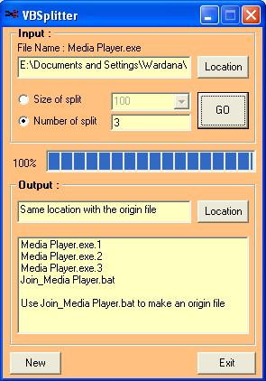



## VBSplitter

### Description

A program to split a large file into smallers file for copying to floppy or sending via email attachment.

The features are :

Split the big file to some small files depend on the number or the size of file-splits

There is a batch file to rejoin the split-files to be back an origin file.
 
### More Info
 

             |
---                |---
**Submitted On**   |2005-07-25 04:40:04
**By**             |[Wardana](https://github.com/Planet-Source-Code/PSCIndex/blob/master/ByAuthor/wardana.md)
**Level**          |Intermediate
**User Rating**    |4.4 (22 globes from 5 users)
**Compatibility**  |VB 5\.0, VB 6\.0
**Category**       |[Complete Applications](https://github.com/Planet-Source-Code/PSCIndex/blob/master/ByCategory/complete-applications__1-27.md)
**World**          |[Visual Basic](https://github.com/Planet-Source-Code/PSCIndex/blob/master/ByWorld/visual-basic.md)
**Archive File**   |[VBSplitter1917077252005\.zip](https://github.com/Planet-Source-Code/wardana-vbsplitter__1-61890/archive/master.zip)

